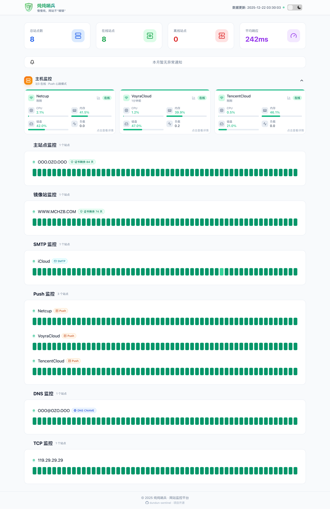
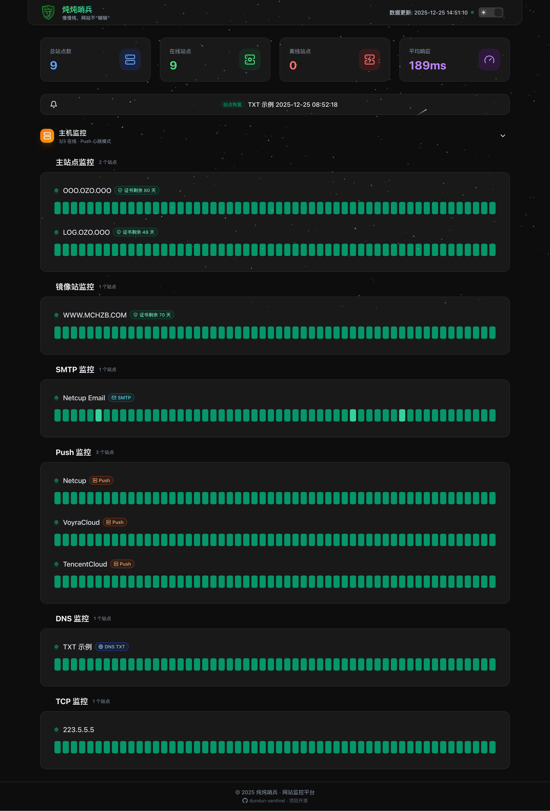
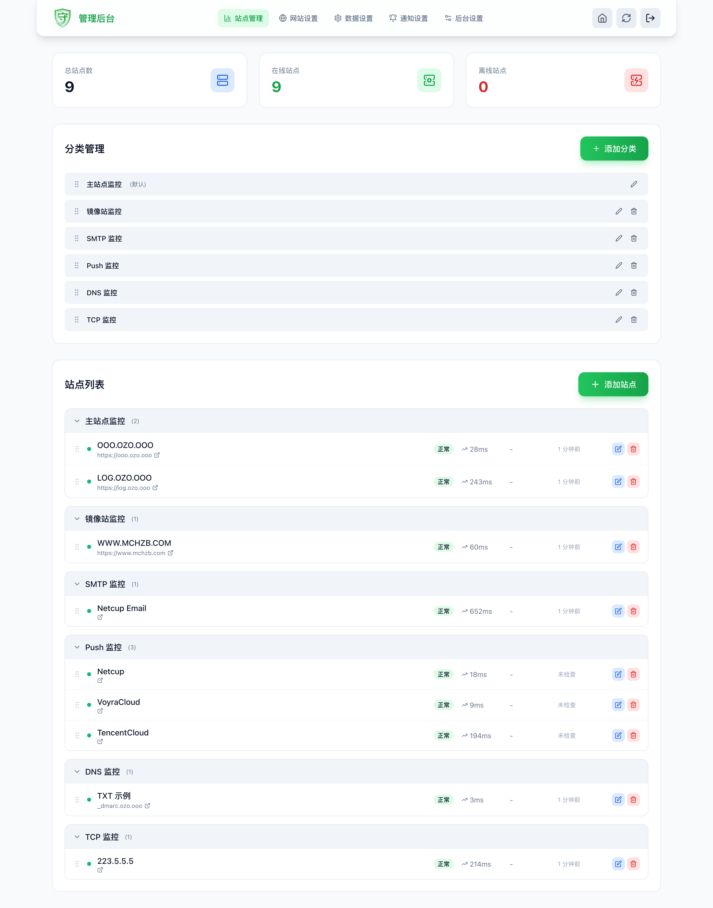
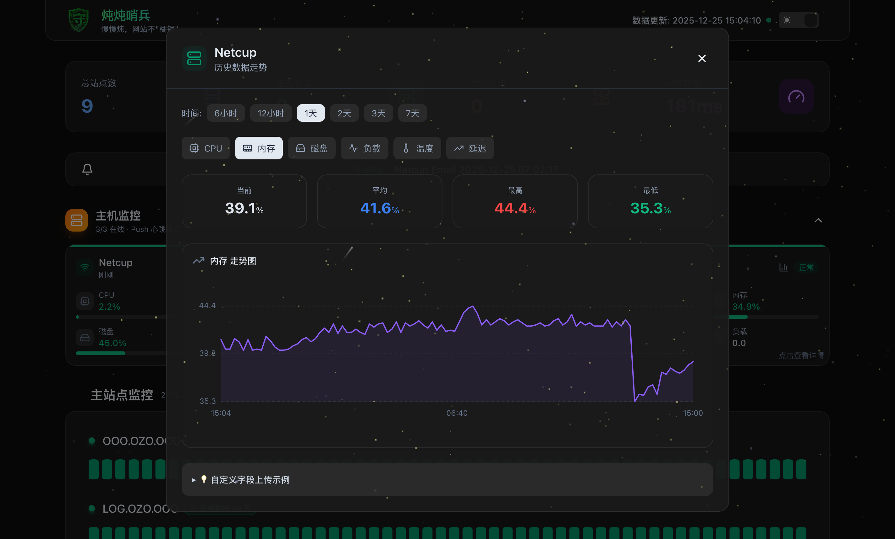
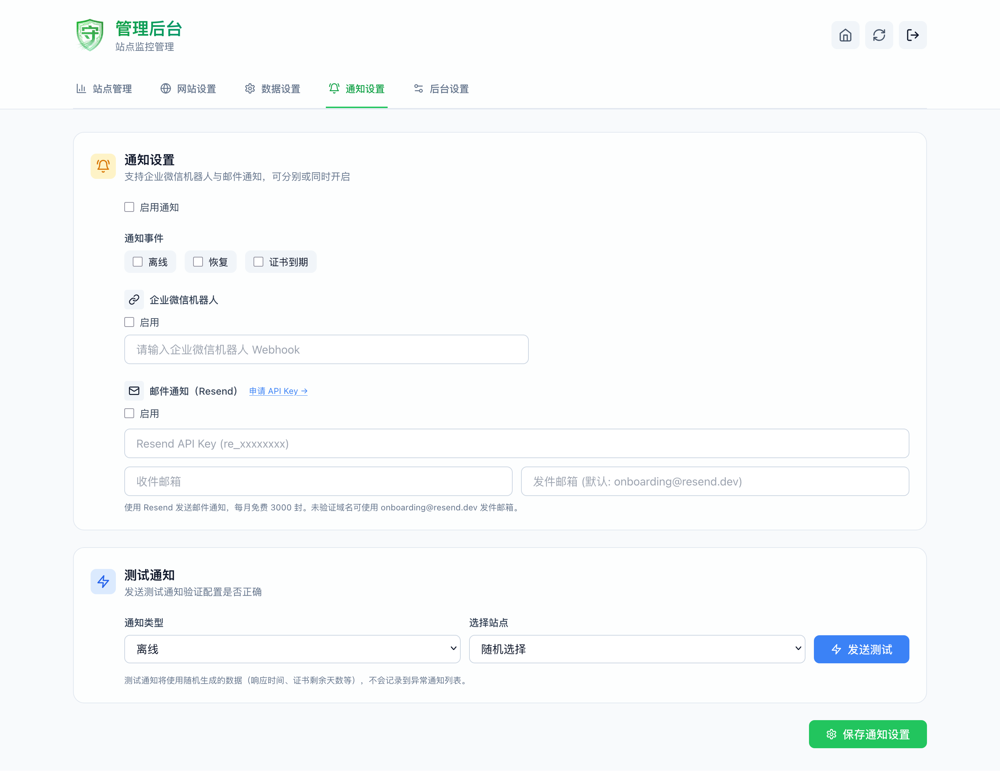
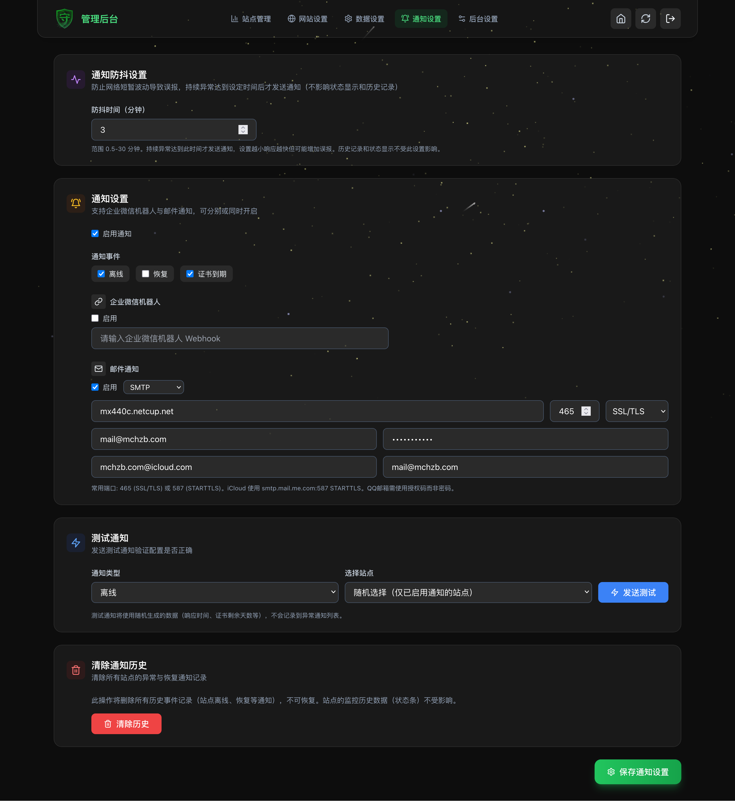

<div align="center">

# 炖炖哨兵

**dundun-sentinel**

轻量级网站监控系统 | 基于 Cloudflare Workers | 完全免费 | 一键部署

[](LICENSE)
[](https://workers.cloudflare.com/)
[](https://github.com/mciart/dundun-sentinel)

[演示站点](https://dundun-sentinel.mciart.workers.dev/) · [快速部署](#-快速部署) · [功能介绍](#-功能特性) · [本地开发](#-本地开发)

---

*慢慢炖，网站不"糊锅"*

</div>

---

## 🔄 相对原项目的主要更改

<!-- 按日期折叠的更新记录：新增条目请在最前面添加一个新的 <details> 区块 -->

<details>
<summary>2025年12月21日 更新（点击展开）</summary>

| 更改 | 说明 |
|------|------|
| **🔥 迁移到 D1 数据库** | 从 KV 迁移到 D1，写入配额从 1,000 次/天提升到 100,000 次/天 |
| **新增 Push 心跳监控** | 支持主机主动上报心跳，可携带 CPU、内存、磁盘、负载、延迟等系统指标 |
| **新增主机监控面板** | 主页展示 Push 类型站点的系统指标卡片 |
| **数据即时持久化** | Push 心跳和监控数据直接写入数据库，无需等待定时同步 |
| **更高的写入配额** | D1 提供 100,000 次/天写入，支持更频繁的检测和心跳 |

</details>

<details>
<summary>2025年12月19 更新（点击展开）</summary>

| 更改 | 说明 |
|------|------|
| **架构优化与重构** | 为提升长期可维护性，项目正在逐步重构为模块化架构 |
| **新增TCP 监控类型** | 你现在可以填写主机名添加 TCP 监控站点了 |
| **保持UI 风格统一** | 为 HTTP(S) 设置添加绿色卡片背景，与 DNS/TCP 风格统一 |
| **修复部分UI 问题** | 修复了点击“刷新”按钮（或执行排序、删除等操作）时，页面会跳动的问题 |
| **修复弹窗闪烁问题** | 修复了在页面中点击“添加站点 / 添加分类 / 编辑站点”会闪烁的问题 |
| **修复站点管理加载缓慢问题** | 优化了部分动画和修复了大部分区域会闪烁的问题 |
| **实现分组与站点的拖拽排序功能** | 你现在可以通过拖拽来调整分组和站点的顺序，超级丝滑！ |

</details>

<details>
<summary>2025年12月18 更新（点击展开）</summary>

| 更改 | 说明 |
|------|------|
| **Workers + Pages 合并** | 将 Cloudflare Workers 和 Pages 合二为一，简化部署流程 |
| **新增后台设置页面** | 你现在可以在后台设置页面直接修改密码和后台路径，不用再改变量了 |
| **新增保留路径检测** | 保留路径检测，防止用户改成保留路径导致路径冲突和误操作，同时你也能改成login了 |
| **新增DNS 监控类型** | 你现在可以填写域名添加 DNS 监控站点了，且能与（如有期望值）匹配做出判断 |
| **优化SSL 证书检测** | 每小时检测一次（手动触发"立即检查"时仍会检测）防止你不小心错误更换证书 |
| **优化DNS 查询** | 并行查询 A 和 AAAA 记录（最多 5 秒），DNS 解析时间减少 60%+ |
| **优化错误消息逻辑** | 错误提示更准确（域名不存在、无A记录、DNS服务器错误等） |
| **优化数据一致性** | 新增数据清理/维护功能，站点删除/修改后会自动清理相关历史数据和通知记录 |
| **优化密码安全性** | 管理员密码使用 SHA-256 哈希存储，不再明文保存！ |
| **优化本地开发测试** | 提升本地开发体验：支持更多调试功能，本地使用 D1 本地数据库 |
| **修复主题开关错误** | 修复自动调整为深色模式时，开关显示在浅色模式位置的问题 |
| **修复Favicon 不显示** | 修复 favicon.ico 图标不显示的问题 |
| **修复URL 变更数据错误** | 现在更新站点时处理 URL 变更，重置检测状态并清除历史记录 |
| **依赖更新** | 更新前端依赖包，提升性能和安全性 |
| **文档完善** | 补充更详细的部署和使用说明，新增常见问题解答 |

</details>

---

<details>
<summary><b>🏗️ 模块化架构重构说明（点击展开）</b></summary>

为提升系统的可扩展性与可维护性，本项目已完成深度模块化重构。新的架构将核心逻辑、业务实现与接口层进行了清晰的解耦：

#### 核心层 (Core & Utils)
- **D1 数据库存储 (`src/core/storage.js`)**：使用 Cloudflare D1 SQL 数据库，提供 100,000 次/天的写入配额。
- **状态管理中心 (`src/core/state.js`)**：标准化的状态读写流程，确保数据一致性。
- **通用工具库 (`src/utils.js`)**：收敛所有基础工具函数，消除重复定义。
- **统计引擎 (`src/core/stats.js`)**：独立的监控数据统计逻辑，解耦业务调度与数据分析。

#### 业务逻辑层 (Services)
- **多协议监控 (`src/monitors/`)**：采用工厂模式，原生支持 **HTTP/HTTPS**、**DNS** (1.1.1.1 DoH)、**TCP** (Cloudflare Sockets) 及 **Push 心跳**。
- **分发式通知 (`src/notifications/`)**：标准化的通知接口，便于集成 Telegram、Webhook、邮件等多种渠道。

#### 接口与分发层 (API & Routing)
- **控制器模式 (`src/api/controllers/`)**：将 `api.js` 拆分为 `auth` (认证)、`sites` (站点)、`config` (配置)、`dashboard` (仪表盘) 等独立模块。
- **清晰的路由映射**：`src/api.js` 仅负责请求分发，业务逻辑完全下沉至控制器。

#### 开发者友好
- **内置 Mock 模式**：支持本地调试时模拟故障（在站点配置中添加 `mock` 字段），方便测试告警与防抖流程。
- **本地模拟环境**：优化本地开发体验，支持本地 D1 数据库调试。

</details>

## 📋 计划更新

以下功能正在计划中，欢迎提交 Issue 或 PR：

| 检测类别         | 实现方式(不依赖第三方)        | 备注                                                         | 状态 |
|------------------|----------------------------------|--------------------------------------------------------------|------|
| HTTP(S) 全类 | 原生 fetch()                     | 包含关键字、JSON 路径、Header 校验                         | 完成 |
| TCP Port     | cloudflare:sockets                | 直接进行 TCP 三次握手                                       | 完成 |
| DNS          | 1.1.1.1 DoH API                   | 虽是 API，但属于 Cloudflare 自家原生服务                   | 完成 |
| Push/心跳    | Worker URL 路由                   | 被动接收主机心跳，支持 CPU/内存/磁盘/延迟等指标上报        | 完成 |
| MySQL/PSQL   | 官方驱动 + connect()              | 直接从 Worker 连数据库握手（只要数据库公网可达）            | 计划 |
| Redis        | connect() + Redis 协议            | 可以实现简单的 PING/PONG 握手                               | 计划 |
| SMTP         | connect()                         | 模拟 SMTP 握手（HELO/EHLO）                                 | 计划 |
| Browser Engine | Browser Rendering                | Cloudflare 自家的渲染引擎（需在后台开启）                   | 计划 |
| MQTT/Kafka   | connect()                         | 只要在代码里集成对应的 JS 版客户端协议库                    | 计划 |
| gRPC         | 原生 fetch (HTTP/2)               | Worker 原生支持 H2，可做 gRPC 探测                          | 计划 |

其他功能：

- [ ] **SSL 证书检测开关** - 可选择是否启用 SSL 证书检测
- [ ] **忽略SSL 错误开关** - 在检测时忽略 TLS/SSL 证书错误
- [ ] **自定义请求超时** - 在后台设置中自定义请求超时时间
- [ ] **自定义检测间隔** - 在后台设置中自定义网站/DNS 检测间隔（D1 每天免费 100,000 次写入）
- [ ] **自定义响应延迟** - 为每个站点单独设置响应时间阈值
- [ ] **短信通知支持** - 集成 Twilio 等短信服务，发送短信通知
- [ ] **通用 Webhook 支持** - 支持自定义 Webhook，可接入钉钉、飞书、Telegram 等
- [ ] **计划维护模式** - 设置站点维护时间段，维护期间不发送通知
- [ ] **批量导入导出** - 站点配置的 JSON 导入导出，方便迁移备份
- [ ] **自定义状态页** - 自定义 Logo、主题色、公告信息
- [ ] **加入自定义检测IPv4或IPv6** - 可选择仅检测 IPv4 或 IPv6 地址，（使用 Happy Eyeballs 算法 判断 IP 协议）
- [ ] **加入更多自定义条件判定** - 比如通过正则表达式匹配响应内容
- [ ] **加入自定义域名解析DOH** - 支持自定义 DNS-over-HTTPS 解析服务
- [ ] **加入反转模式** - 反转监控状态。如果服务可访问，则认为是故障

已完成：
- [x] **加入主机深度检测板块** - 基于心跳监控对主机进行被动探测（Push 模式）

---

## 📸 预览截图

<div align="center">

| 主页 - 浅色模式 | 主页 - 深色模式 |
|:---:|:---:|
|  |  |

| 后台站点管理 - 浅色模式 | 后台站点管理 - 深色模式 |
|:---:|:---:|
|  |  |

| 后台设置 - 浅色模式 | 后台通知 - 深色模式 |
|:---:|:---:|
|  |  |

</div>

---

## ✨ 功能特性

| 功能 | 说明 |
|------|------|
| 🌐 网站监控 | 支持 HTTP/HTTPS，DNS，自动检测在线状态 |
| ⏱️ 响应统计 | 记录响应时间，计算平均响应 |
| 🔒 SSL 监控 | 自动检测证书到期时间，提前预警 |
| 📊 历史记录 | 保留 30 天监控数据，状态条可视化 |
| 📁 分组管理 | 自定义分组，支持图标和颜色 |
| 💬 企业微信 | 站点异常时推送通知 |
| 📧 邮件通知 | 支持 Resend 邮件通知 |
| 🌙 深色模式 | 支持明暗主题切换 |
| 📱 响应式 | 适配手机、平板、电脑 |
| ⚙️ 高级配置 | 自定义请求方式、请求头、状态码、关键词检测 |

---

## 🚀 快速部署

整个过程约 **5 分钟**，无需编程知识。

### 第一步：Fork 项目

1. 打开 [dundun-sentinel](https://github.com/mciart/dundun-sentinel)
2. 点击右上角 **Fork** 按钮
3. 点击 **Create fork** 完成

### 第二步：获取 Cloudflare 凭据

#### 2.1 获取 API Token

1. 登录 [Cloudflare Dashboard](https://dash.cloudflare.com)
2. 点击右上角头像 → **My Profile** → **API Tokens**
3. 点击 **Create Token**
4. 选择 **Edit Cloudflare Workers** 模板
5. Account Resources 选择 **Include - All accounts**
6. Zone Resources 选择 **Include - All zones**
7. 点击 **Continue to summary** → **Create Token**
8. **复制 Token**（只显示一次！）

#### 2.2 获取 Account ID

1. 登录 [Cloudflare Dashboard](https://dash.cloudflare.com)
2. 进入 **Workers & Pages**
3. 在右侧栏找到 **Account ID**
4. 复制该 ID

### 第三步：配置 GitHub Secrets

打开你 Fork 的项目 → **Settings** → **Secrets and variables** → **Actions**

点击 **New repository secret**，添加以下密钥：

#### 必填配置

| Name | Value | 说明 |
|------|-------|------|
| `CLOUDFLARE_API_TOKEN` | 你的 API Token | **必填** |

### 第三步（新增）：创建 D1 数据库

⚠️ **重要**：首次部署前需要手动创建 D1 数据库！

1. 登录 [Cloudflare Dashboard](https://dash.cloudflare.com)
2. 进入 **Workers & Pages** → **D1 SQL Database**
3. 点击 **Create** 按钮
4. 数据库名称填写：`dundun-sentinel-db`
5. 点击 **Create** 完成创建
6. 记下创建后显示的 **Database ID**（后续会自动配置）

> 💡 **说明**：GitHub Actions 会自动检测并使用名为 `dundun-sentinel-db` 的数据库。
> 
> 🔒 **安全建议**：部署成功后，请立即登录后台修改默认密码和后台路径。在后台修改的设置不会被后续更新部署覆盖。

### 第四步：运行部署

1. 进入项目 → **Actions** 标签
2. 如有提示，点击 **I understand my workflows, go ahead and enable them**
3. 左侧选择 **Deploy to Cloudflare Workers**
4. 点击 **Run workflow** → 再点击绿色 **Run workflow**
5. 等待完成，看到绿色勾 ✅ 即部署成功

### 第五步：访问网站

1. 登录 [Cloudflare Dashboard](https://dash.cloudflare.com)
2. 进入 **Workers & Pages**
3. 找到 **dundun-sentinel** 项目
4. 点击访问地址即可

**默认后台地址：** `你的域名/admin`  
**默认密码：** `admin`

---

## 🔄 更新与重新部署

### 同步最新版本

Fork 项目后，如果原项目有更新，你可以同步最新代码：

1. 打开你 Fork 的项目页面
2. 点击代码区域上方的 **Sync fork** 按钮
3. 点击 **Update branch** 同步最新代码
4. 同步后会自动触发 GitHub Actions 重新部署

### 重新部署

如果修改了 GitHub Secrets 配置（如密码、后台路径等），需要手动触发重新部署：

1. 进入项目 → **Actions** 标签
2. 左侧选择 **Deploy to Cloudflare Workers**
3. 点击 **Run workflow** 下拉菜单
4. 选择分支（默认 main 或 master）
5. 点击绿色 **Run workflow** 按钮
6. 等待部署完成，新配置即生效

---

## 🌐 自定义域名配置

Cloudflare Workers 支持多种域名绑定方式：

### 方式一：Custom Domains（推荐）

最简单的方式，适合绑定独立域名或子域名：

1. 登录 [Cloudflare Dashboard](https://dash.cloudflare.com)
2. 进入 **Workers & Pages** → 找到 **dundun-sentinel** 项目
3. 点击 **Settings** → **Domains & Routes**
4. 点击 **Add** → **Custom Domain**
5. 输入域名（如 `status.example.com`）
6. 点击 **Add Custom Domain**
7. Cloudflare 会自动配置 DNS 记录

> 注意：域名必须已添加到你的 Cloudflare 账户中

### 方式二：Routes（路由规则）

适合更灵活的路径匹配：

1. 进入 **Workers & Pages** → **dundun-sentinel** 项目
2. 点击 **Settings** → **Domains & Routes**
3. 点击 **Add** → **Route**
4. 选择 Zone（你的域名）
5. 输入路由规则，例如：
   - `status.example.com/*` - 匹配子域名所有路径
   - `example.com/status/*` - 匹配主域名的特定路径
6. 点击 **Add Route**

### 方式三：workers.dev 子域名

无需配置，部署后自动获得：

`dundun-sentinel.<你的账户>.workers.dev`

可在 **Settings** → **Domains & Routes** 中查看或禁用。

---

## 📖 使用说明

### 添加监控站点

1. 登录后台（默认密码 `admin`）
2. 点击 **添加站点**
3. 填写名称和 URL
4. 可选：配置高级选项（请求方式、请求头等）
5. 保存

### 通知设置

1. 切换到 **通知设置** 标签
2. 开启通知 → 配置企业微信 Webhook 或 Resend 邮件
3. 点击 **发送测试** 验证

### 修改密码/后台路径

登录后台 → 切换到 **后台设置** 标签 → 修改密码或后台路径

> 💡 在后台修改的设置会存储到 D1 数据库，后续更新部署时不会被覆盖。

---

## 💻 本地开发

### 环境要求

- Node.js 18+
- npm 或 pnpm

### 快速启动

```bash
# 克隆项目
git clone https://github.com/mciart/dundun-sentinel.git
cd dundun-sentinel

# 安装依赖
npm install
cd frontend && npm install && cd ..

# 构建前端并启动开发服务器
npm run dev
```

访问：`http://localhost:8787`

### 常用命令

| 命令 | 说明 |
|------|------|
| `npm run dev` | 本地开发（构建前端 + 启动服务） |
| `npm run dev:frontend` | 仅启动前端热重载 |
| `npm run build` | 构建前端 |
| `npm run deploy` | 手动部署到 Cloudflare |
| `npm run tail` | 查看线上日志 |

### 项目结构（已模块化）

```
dundun-sentinel/
├── src/                          # Worker 源代码（模块化）
│   ├── index.js                  # 主入口
│   ├── core/
│   │   ├── storage.js            # D1 数据库存储层
│   │   └── utils.js              # 通用工具函数
│   ├── monitors/                 # 各协议监控实现与工厂
│   │   ├── index.js              # 监控工厂
│   │   ├── http.js
│   │   ├── dns.js
│   │   ├── tcp.js
│   │   └── mock.js               # 本地调试/单元测试 mock 支持
│   ├── notifications/            # 通知渠道实现与分发器
│   │   ├── index.js
│   │   ├── wecom.js
│   │   └── email.js
│   └── api/                      # 路由 + 控制器
│       ├── router.js
│       └── controllers/
│           ├── auth.js
│           └── sites.js
├── frontend/                      # 前端项目 (React + Vite)
│   ├── src/                       # 前端源码
│   ├── public/
│   └── dist/                      # 构建产物
├── docs/                          # 截图与文档
├── tests/                         # 单元测试（含 monitors 的 mock 测试）
├── .github/workflows/
│   └── deploy.yml                 # 自动部署工作流
├── wrangler.toml                  # Cloudflare Worker 配置
├── package.json
└── README.md
```

---

## ❓ 常见问题

<details>
<summary><b>部署失败怎么办？</b></summary>

1. 检查 GitHub Secrets 是否正确配置（三个都要填）
2. 检查 API Token 权限是否完整
3. 查看 Actions 日志定位错误

</details>

<details>
<summary><b>监控间隔是多久？</b></summary>

默认每分钟检测一次所有站点。

</details>

<details>
<summary><b>数据保留多久？</b></summary>

默认保留 30 天历史数据。

</details>

<details>
<summary><b>有使用限制吗？</b></summary>

Cloudflare Workers 免费版每天 10 万次请求，个人使用完全够用。

</details>

<details>
<summary><b>如何绑定自定义域名？</b></summary>

请参考上方 [自定义域名配置](#-自定义域名配置) 章节。

</details>

---

## 🛠️ 技术栈

| 类型 | 技术 |
|------|------|
| 前端 | React + Vite + TailwindCSS |
| 后端 | Cloudflare Workers |
| 数据库 | Cloudflare D1 (SQLite) |
| 部署 | GitHub Actions + Cloudflare |

---

## 📏 监控规则与缓存机制

### 检测周期

| 监控类型 | 检测方式 | 检测频率 | 说明 |
|----------|----------|----------|------|
| HTTP/HTTPS | Cron 主动检测 | 每分钟 | Cloudflare Cron 触发 |
| DNS | Cron 主动检测 | 每分钟 | 通过 1.1.1.1 DoH API |
| TCP | Cron 主动检测 | 每分钟 | 通过 Cloudflare Sockets |
| Push 心跳 | 被动接收 | 实时 | 主机主动上报 |
| SSL 证书 | Cron 检测 | 每小时 | 证书变化慢，无需频繁检测 |

### D1 数据库架构

```
┌─────────────────────────────────────────────────────────────┐
│                     数据流向                                 │
├─────────────────────────────────────────────────────────────┤
│                                                             │
│  ┌─────────┐    ┌──────────────┐    ┌─────────────────┐    │
│  │ Cron    │───▶│ 检测站点状态  │───▶│   D1 数据库     │    │
│  │ (每分钟) │    └──────────────┘    │  (实时写入)     │    │
│  └─────────┘                         └────────┬────────┘    │
│                                               │             │
│  ┌─────────┐    ┌──────────────┐              │             │
│  │ Push    │───▶│ 接收心跳数据  │───▶  D1 数据库           │
│  │ (实时)  │    └──────────────┘    (实时写入)             │
│  └─────────┘                                  │             │
│                                               ▼             │
│                    ┌──────────────────────────────────┐     │
│                    │        前端 API 请求              │     │
│                    │      (从 D1 数据库读取)           │     │
│                    └──────────────────────────────────┘     │
│                                                             │
└─────────────────────────────────────────────────────────────┘
```

### D1 数据库特点

| 特性 | 说明 |
|------|------|
| **实时持久化** | 所有数据立即写入数据库，无数据丢失风险 |
| **高写入配额** | 每天 100,000 次写入（免费版），是 KV 的 100 倍 |
| **SQL 查询** | 支持复杂查询，便于数据分析和统计 |
| **事务支持** | 批量操作保证数据一致性 |

### Push 心跳模式

Push 心跳支持上报以下字段：

```bash
# 简单心跳（仅在线状态）
curl -X POST "https://your-worker.workers.dev/api/push/YOUR_TOKEN"

# 带系统指标的心跳
curl -X POST "https://your-worker.workers.dev/api/push/YOUR_TOKEN" \
  -H "Content-Type: application/json" \
  -d '{
    "cpu": 25.5,
    "memory": 60.2,
    "disk": 45.0,
    "load": 1.5,
    "uptime": 86400,
    "temperature": 55,
    "latency": 15,
    "network": {"rx": 1024, "tx": 512},
    "custom": {"key": "value"}
  }'
```

| 字段 | 类型 | 说明 |
|------|------|------|
| `cpu` | number | CPU 使用率 (%) |
| `memory` / `mem` / `ram` | number | 内存使用率 (%) |
| `disk` | number | 磁盘使用率 (%) |
| `load` | number | 系统负载 |
| `uptime` | number | 运行时间（秒） |
| `temperature` / `temp` | number | 温度 (°C) |
| `latency` | number | 延迟/响应时间 (ms) |
| `network` | object | 网络流量信息 |
| `custom` | object | 自定义数据 |

### D1 配额说明

Cloudflare D1 免费版每天 **100,000 次写入**，相比 KV 的 1,000 次提升了 100 倍。

| 监控站点数 | 每分钟检测 | 估算每日写入 | 配额占用 |
|-----------|-----------|-------------|---------|
| 10 个站点 | 10 次 | ~14,400 次 | 14.4% |
| 50 个站点 | 50 次 | ~72,000 次 | 72% |
| 100 个站点 | 100 次 | ~144,000 次 | 超配额 |

> **提示**：D1 的高配额足以支持大多数使用场景。如需监控更多站点，可考虑升级到付费版或调整检测频率。

---

## 📄 开源协议

本项目基于 [MIT](LICENSE) 协议开源。

---

<div align="center">

### ⭐ 如果觉得项目不错，欢迎点个 Star 支持一下！

</div>
